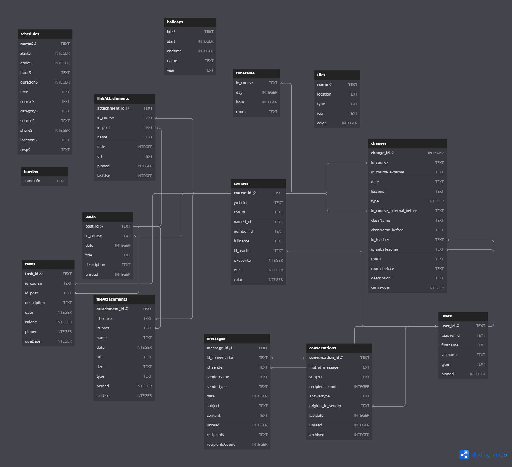

> # ⚠ Maintainers needed
> I am now done with school and don't have credentials for Schulportal anymore.<br/>
> However, as Schulportal keeps evolving, the app has to keep pace in order to not stop working because of unexpected data. This is why I ask __you__ to donate your time to the benefit of Hessian students :)<br/>
> If I would have had time, there were also plans for more features to make the app even better than the original website, some of which are actually partly implemented.<br/>
> ```diff
> ! So, if you are interested in learning about and improving yourself in: 
> ```
> - Native Android app development with Kotlin
> - Webscraping (using Jsoup in this case)
> - Managing a touch more complicated projects
> - Supporting a growing user base of currently _several hundred_ users
> ```diff
> ! Hit me up 
> ```
> [Send me a message on Twitter](https://twitter.com/koenidv) or [post me an email](https://github.com/koenidv).<br/>
> Looking forward to hearing from you 👋

# [SPHplanner on Google Play](https://play.google.com/store/apps/details?id=de.koenidv.sph?utm_source=gh_head)
Android app to easily access Hesse's education portal - 
*SPH: Schulportal Hessen / Education Portal Hesse*

<details>

<summary>Screenshots</summary>

<p float="left">
  
   
  
  
  
  
  
</p>

</details>

### Advantages compared to SPH's website
- [x] Presenting way more data at a glance
- [x] Easier and faster to use
- [x] Skip signing in every time 
- [x] Works even when SPH is under maintenance or offline

### Features
- [x] Personal timetable (that works better than sph's)
- [x] Personal changes in the timetable
- [x] Overview of undone tasks & unread posts
- [x] Send and receive messages to teachers (starting in 1.3)
- [x] Rename and pin attachments, keep them offline
- [x] Display posts from SPH

### Future plans
- [ ] Notifications
- [ ] Manually edit courses
- [ ] More reliably support more schools (always wip)
- [ ] Displaying grades and attendances 
- [ ] Submit files to assignments
- [ ] Add own tasks / grades / attendances

### Contributing
Simply submit a pull request and you're ready to go!
Please keep each PR limited to one change, feature or a logical set of changes.
If you'd like to make a more substantial change, you might want to [get in touch](mailto:32238636+koenidv@users.noreply.github.com) first.

### Building
Simply cloning the repository from Android Studio should be plenty.

### Debugging
As of version 122, there's an easily shareably debug logger. There is an [online tool](https://koenidv.github.io/sph-planner/debugger) to visualize its data.

### ... development space

The following db diagram is for wrapping my mind around what we've built years ago. It's AI generated and might contain errors.
